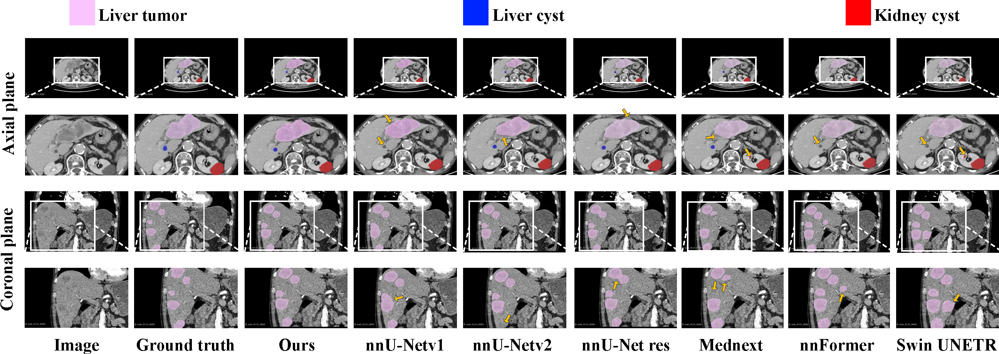

##  MSWAL : 3D Multi-class Segmentation of Whole Abdominal Lesions Dataset

This repo presents the implementation of the **MSWAL 🩻** 

The paper is under review by MICCA 2025.

## Key Features of MASWAL 🔑

- **Comprehensive Coverage**: maswal includes **seven common abdominal lesions** (gallstones, kidney stones, liver tumors, kidney tumors, pancreatic cancer, liver cysts, and kidney cysts), addressing the single-organ focus of existing datasets.  

- **Fine-Grained Annotation**: Lesions are **specifically categorized by type**, unlike "pan-cancer" labeling, enabling precise diagnostic suggestions and reducing radiologists' workload.  

- **Full Annotation**: maswal is **fully annotated** with no missing labels, minimizing noise and enhancing model performance compared to partially annotated datasets.

## Stastics of MASWAL 📊

MSWAL comprises **694 high-resolution CT scans** (191,417 slices) with **7 lesion types** (e.g., liver tumors, kidney stones), balanced gender distribution (53.9% male, 46.1% female), and diverse CT contrast phases (non-contrast, arterial, venous, etc.), offering a **fully annotated, multi-class dataset** for precise abdominal lesion segmentation.
<div align=center></div>

## Examples of MASWAL 📊
<div align=center></div>

## Inception nnU-Net structure 📊

<div align=center></div>


## Get Started ⚡️ 
Inception nnU-Net in this paper is highly dependent on the preprocessing and architecture of nnU-Net. You can find how nnU-Net works here: [nnU-Net](https://github.com/MIC-DKFZ/nnUNet)

## Step 1: Requirements.

```bash
Conda create -n IncUnet --python == 3.8
git clone https://github.com/MIC-DKFZ/nnUNet.git
cd nnUNet
pip install -e .
```

## Step 2: Preprocess the MASWAL.
Create a folder for MASWAL, which has three sub-folders: nnU-Net_raw; nnUNet_preprocessed; nnUNet_results. More details can be seen in [nnU-Net's dataset_format](https://github.com/MIC-DKFZ/nnUNet/blob/master/documentation/dataset_format.md). 

### MASWAL Folder Structure

MASWAL/  
├── nnU-Net_raw/  
│   ├── dataset.json  # Dataset configuration file  
│   ├── imagesTr/    # Training images  
│   ├── imagesTs/    # Testing images  
│   ├── labelsTr/    # Training labels  
│   └── labelsTs/    # Testing labels  
├── nnUNet_preprocessed/  # Preprocessed data (automatically generated by nnU-Net)  
└── nnUNet_results/       # Training results and model outputs  

### Instructions:
1. Save the dataset in **nnU-Net_raw** following the [nnU-Net dataset format](https://github.com/MIC-DKFZ/nnUNet/blob/master/documentation/dataset_format.md).  
2. Modify environment variables to point to the MASWAL folder for nnU-Net processing.


```bash
vim ~/.bashrc
```
Set the path to the dataset if you are using Linux.
```bash
export nnUNet_raw='data_fold_path/nnUNet_raw'
export nnUNet_preprocessed='data_fold_path/nnUNet_preprocessed'
export nnUNet_results='data_fold_path/nnUNet_results'
```
Then update the environment variables.
```bash
source ~/.bashrc
```
If you want to reproduce the Inception nnU-Net on MSWAL, please modify epoch to 1500 and initial learning rate to 0.001 in [nnUNetTrainer.py](https://github.com/MIC-DKFZ/nnUNet/blob/master/nnunetv2/training/nnUNetTrainer/nnUNetTrainer.py)(OPTIONAL).
Now you can preprocess the dataset.
```bash
nnUNetv2_plan_and_preprocess -d DATASET_ID --verify_dataset_integrity -c 3d_fullres -p nnUNetResEncUNetLPlans
```

## Step 3: install dynamic_network_architectures
```bash
git clone https://anonymous.4open.science/r/MSWAL--406B.git
cd dynamic_network_architectures
pip install -e .
```

## Step 4: train the model.
Modify network_class_name in 3d_fullres to "dynamic_network_architectures.architectures.inception.InceptionNnunet" in nnUNetResEncUNetLPlans.json and change the relevant batch_size to smaller (dependent on your GPU). Then run the training process. We use  five-fold cross-validation to train the model.
```bash
nnUNetv2_train DATASET_ID 3d_fullres 0 -p nnUNetResEncUNetLPlans
nnUNetv2_train DATASET_ID 3d_fullres 1 -p nnUNetResEncUNetLPlans
nnUNetv2_train DATASET_ID 3d_fullres 2 -p nnUNetResEncUNetLPlans
nnUNetv2_train DATASET_ID 3d_fullres 3 -p nnUNetResEncUNetLPlans
nnUNetv2_train DATASET_ID 3d_fullres 4 -p nnUNetResEncUNetLPlans
```
## Step 5: run inference
```bash
nnUNetv2_predict -i INPUT_FOLDER -o OUTPUT_FOLDER -d DATASET_NAME_OR_ID -c 3d_fullres -f 0 1 2 3 4 -p nnUNetResEncUNetLPlans
```
## Step 6: evaluation
```bash
nnUNetv2_evaluate_folder -djfile path/dataset.json -pfile path/plans.json path/labelsTs path/infersTs
```


